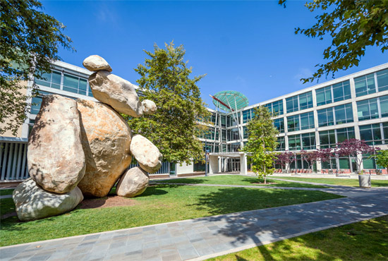

# Welcome to my page

1. **Introduction**
   - Hi, my name is Emma Nguyen. Welcome to my page!
  
     
   - I am a 3th year Computer Science major in Sixth. I always think that I am very blessed to be a student of UC San Diego.
   - Programming languages: `Java`, `C++`, `Python`.
   - Tools: `Visual Studio Code`, `IntelliJ`, `Pycharm`, `Visual Studio`, `R`, `Git`

3. **Volunteering**
     
   - I had an opportunity to collaborate with a team to design and teach lessons with the topic "Introduction to Computer Programming" to students at Clark Middle School, “Introduction to Python Programming” at San Diego high school. I was participating in this volunteer activity as part of the requirements for CSE 198 - HNK Outreach at UC San Diego. This program facilitates the creation and delivery of interactive and engaging lessons to socioeconomically disadvantaged K-12 students in the San Diego area. This volunteer experience provided me with invaluable teaching experience in the field of computers, allowing me to effectively share my knowledge and insights. Through this outreach, I gained crucial insights into effective teaching strategies for middle school students and the importance of fostering an early interest in technology.

4. **Hobbies**
   - I like playing pingpong, watching muovies and listening to music. My favorite instrument is piano.
     
5. **Relative links:**
   - Relative links: [My Linked](https://www.linkedin.com/in/emma-nguyen-84a226117/)

